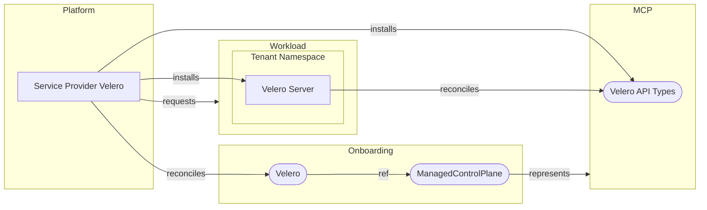

[](https://api.reuse.software/info/github.com/openmcp-project/service-provider-template)

# service-provider-velero

## About this project

Service provider velero manages the lifecycle of [Velero](https://velero.io) instances in an [openMCP](https://github.com/openmcp-project) landscape.

## Requirements and Setup

To run service-provider-velero locally, use the end-to-end test suite provided with [openmcp-testing](https://github.com/openmcp-project/openmcp-testing):

```shell
task test-e2e
```

## Velero API

A user can request Velero for a managed control plane by choosing the Velero version and which plugins to install. The available options are defined by the platform operator via the [ProviderConfig](#providerconfig-api).

```yaml
apiVersion: velero.services.openmcp.cloud/v1alpha1
kind: Velero
metadata:
  name: test-aws-a
spec:
  version: "v1.17.2"
  plugins:
    - name: "aws"
      version: "v1.13.2"
```

## ProviderConfig API

Service provider Velero requires a `ProviderConfig` on the platform cluster to reconcile [Velero resources](#velero-api). The provider config allows platform operators to:

- restrict the Velero and plugins versions an end users may select,
- configure image pull secrets for proviate OCI registries (supporting air gapped environments)
- define a reconciliation poll interval, used to detect drift in resources deployed to the workload cluster and managed control plane. The poll interval is also used to refresh the service account token that velero uses to access the watched managed control plane.

```yaml
apiVersion: velero.services.openmcp.cloud/v1alpha1
kind: ProviderConfig
metadata:
  name: velero
spec:
  pollInterval: 15m
  availableImages:
    - name: velero
      versions: ["v1.17.2", "v1.16.2"]
      image: "velero/velero"
    - name: aws
      versions: ["v1.13.2", "v1.12.2"]
      image: "velero/velero-plugin-for-aws"
  imagePullSecrets:
    - name: privateregcred
```

**Note:** Only one provider config may exist per velero service provider instance and its name must match the service provider's name.

## Deployment Model

Service provider Velero deploys the Velero server onto the workload cluster, while the Velero CRDs are installed on the MCP. Each tenant is isolated within its own namespace.



The Velero documentation provides an overview of the [Velero API types](https://velero.io/docs/main/api-types/) installed on the MCP. The API types may vary across installations depending on the specific Velero version an end-user selects.

**Note:** The Kubernetes nodes on the workload cluster where the Velero server pods run must be able to resolve and reach any [backup storage location](https://velero.io/docs/main/locations/).

## Development

Generate code after making API changes:

```shell
task generate
```

Run unit tests:

```shell
task test
```

Build a Docker image with your latest changes:

```shell
task build:img:build-test
```

Run code validation:

```shell
task validate
```

## Support, Feedback, Contributing

This project is open to feature requests/suggestions, bug reports etc. via [GitHub issues](https://github.com/openmcp-project/service-provider-template/issues). Contribution and feedback are encouraged and always welcome. For more information about how to contribute, the project structure, as well as additional contribution information, see our [Contribution Guidelines](CONTRIBUTING.md).

## Security / Disclosure

If you find any bug that may be a security problem, please follow our instructions at [in our security policy](https://github.com/openmcp-project/service-provider-template/security/policy) on how to report it. Please do not create GitHub issues for security-related doubts or problems.

## Code of Conduct

We as members, contributors, and leaders pledge to make participation in our community a harassment-free experience for everyone. By participating in this project, you agree to abide by its [Code of Conduct](https://github.com/SAP/.github/blob/main/CODE_OF_CONDUCT.md) at all times.

## Licensing

Copyright 2025 SAP SE or an SAP affiliate company and service-provider-template contributors. Please see our [LICENSE](LICENSE) for copyright and license information. Detailed information including third-party components and their licensing/copyright information is available [via the REUSE tool](https://api.reuse.software/info/github.com/openmcp-project/service-provider-template).
